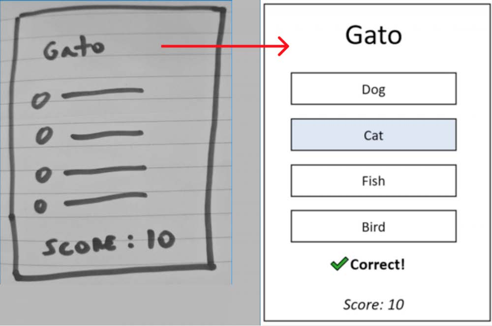

# JavaScript Mini-Projects: Language Learning Game

Este repositório contém os arquivos referentes ao projeto desenvolvido durante a formação ministrada no curso <strong>Phaser Mini-Degree</strong>, oferecido pela <a href="https://academy.zenva.com/">Zenva Academy</a>!

O objetivo desse projeto é desenvolver um jogo de aprendizado de palavras, conforme o mockup abaixo:

    

Para ser redirecionado para a página do curso, <a href="https://academy.zenva.com/course/intro-html5-game-development-mini-degree/">clique aqui</a>!

